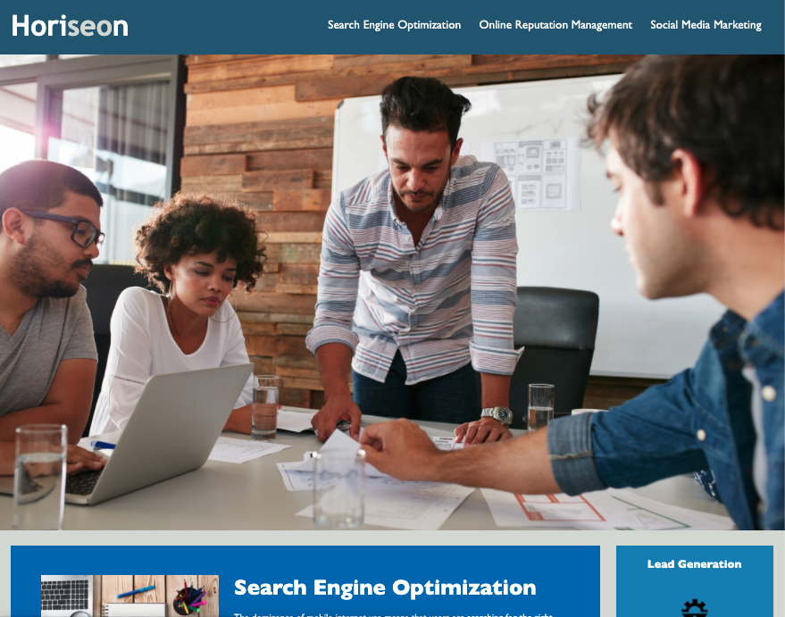
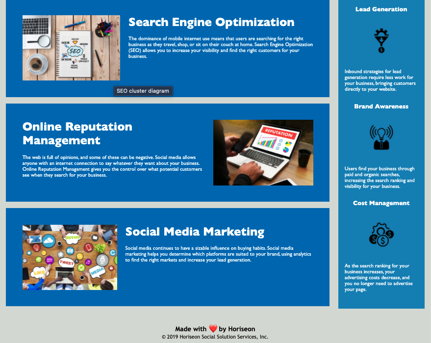

# Horiseon Accessibility Refactor

## Description

Horiseon is a marketing consulting company who requested a refactor that follows accessibility standards for SEO (search-engine-optimization).

### Features

This page has been optimized for user accessibility relative to screen readers used on a desktop computer. The semantic elements applied provide ease and efficiency with navigation and image titles and description; as well as, improved SEO.

### Visuals

### Links

[DeployedApplication](<https://nahco-code.github.io/horiseon-accessibility-refactor/>)
